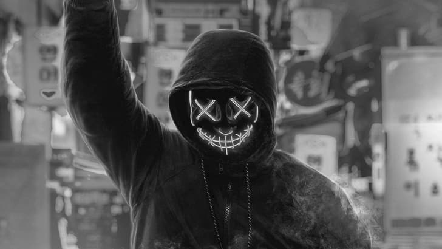

# COLOUR-CONVERSION
## AIM:
To perform the color conversion between RGB, BGR, HSV, and YCbCr color models.

## SOFTWARE REQUIRED:
Anaconda - Python 3.7
## ALGORITHM:
### Step1:
Import cv2 and save and image as filename.png

### Step2:
Use imread(filename, flags) to read the file

### Step3:
Use cv2.cvtColor(src, code, dst, dstCn) to convert an image from one color space to another.

### Step4:
Split and merge the image using cv2.split and cv2.merge commands.

### Step5:
End the program and close the output image windows.

## PROGRAM:

Developed By : SV ROHITHKUMAR

Register Number : 212221230084
# i) Original Image
```
import cv2
uni = cv2.imread('anonymous.jpg')
cv2.imshow('Original image',uni)
cv2.waitKey(0)
cv2. destroyAllWindows()
```
# ii) Convert BGR to HSV 
```
import cv2
uni = cv2.imread('anonymous.jpg')
hsv_image = cv2.cvtColor(uni, cv2.COLOR_BGR2HSV)
cv2.imshow('BGR2HSV' ,hsv_image )
cv2.waitKey(0)
cv2. destroyAllWindows()
```
# iii)Convert BGR to GRAY
```
import cv2
uni = cv2.imread('anonymous.jpg')
gray_image = cv2.cvtColor(uni, cv2.COLOR_BGR2GRAY)
cv2.imshow( 'BGR2GRAY', gray_image)
cv2.waitKey(0)
cv2. destroyAllWindows()
```
# iv) Convert RGB to HSV
```
import cv2
uni = cv2.imread('anonymous.jpg')
hsv_image = cv2.cvtColor(uni, cv2.COLOR_RGB2HSV)
cv2.imshow('RGB2HSV', hsv_image)
cv2.waitKey(0)
cv2. destroyAllWindows()
```
# v)  Convert RGB to GRAY
```
import cv2
uni = cv2.imread('anonymous.jpg')
gray_image1 = cv2.cvtColor (uni, cv2.COLOR_RGB2GRAY)
cv2.imshow('RGB2GRAY', gray_image1)
cv2.waitKey(0)
cv2. destroyAllWindows()
```
# vi) Convert HSV to RGB
```
import cv2
uni = cv2.imread('anonymous.jpg')
RGB_image = cv2.cvtColor(uni,cv2.COLOR_HSV2RGB)
cv2.imshow('HSV to RGB',RGB_image )
cv2.waitKey(0)
cv2.destroyAllWindows()
```
# vii)  Convert HSV to BGR
```
import cv2
uni = cv2.imread('anonymous.jpg')
BGR_image = cv2.cvtColor(uni,cv2.COLOR_HSV2BGR)
cv2.imshow('HSV to BGR',BGR_image)
cv2.waitKey(0)
cv2.destroyAllWindows()
```
# viii)  Convert RGB to YCrCb
```
import cv2
uni = cv2.imread('anonymous.jpg')
YCrCb_image = cv2.cvtColor(uni, cv2.COLOR_RGB2YCrCb)
cv2.imshow('RGB2YCrCb',YCrCb_image)
cv2.waitKey(0)
cv2.destroyAllWindows()
```
# ix) Convert BGR to YCrCb
```
import cv2
uni = cv2.imread('anonymous.jpg')
YCrCb_image = cv2.cvtColor(uni, cv2.COLOR_BGR2YCrCb)
cv2.imshow('BGR2YCrCb',YCrCb_image)
cv2.waitKey(0)
cv2.destroyAllWindows()
```
# x) Merge RGB Image
```
import cv2
uni = cv2.imread('anonymous.jpg')
blue=uni[:,:,0]
green=uni[:,:,1]
red=uni[:,:,2]
cv2.imshow('B-Channel',blue)
cv2.imshow('G-Channel',green)
cv2.imshow('R-Channel',red)

merged_BGR=cv2.merge((blue,green,red))
cv2.imshow('Merged BGR Image',merged_BGR)
cv2.waitKey(0)
cv2.destoryAllWindows()
```
# xi) Split HSV Image
```
import cv2
uni = cv2.imread('anonymous.jpg')
hsv=cv2.cvtColor(uni,cv2.COLOR_BGR2HSV)
h,s,v=cv2.split(hsv)
cv2.imshow("Hue-image",h)
cv2.imshow("Saturation-image",s)
cv2.imshow("gray-image",v)
```
# xii) Merge HSV Image
```
Merged_HSV=cv2.merge((h,s,v))
cv2.imshow('Merged HSV Image',Merged_HSV)
cv2.waitKey(0)
cv2.destoryAllWindows()
```
## OUTPUT:
### i) Original Image


### ii) Convert BGR to HSV


### iii)Convert BGR to GRAY



### iv) Convert RGB to HSV


### v) Convert RGB to GRAY


### vi) Convert HSV to RGB


### vii) Convert HSV to BGR


### viii) Convert RGB to YCrCb


### ix) Convert BGR to YCrCb


### x) Merge RGB Image


### xi) Split HSV Image and xii) Merge HSV Image


## RESULT:
Thus the color conversion was performed between RGB, HSV and YCbCr color models.
